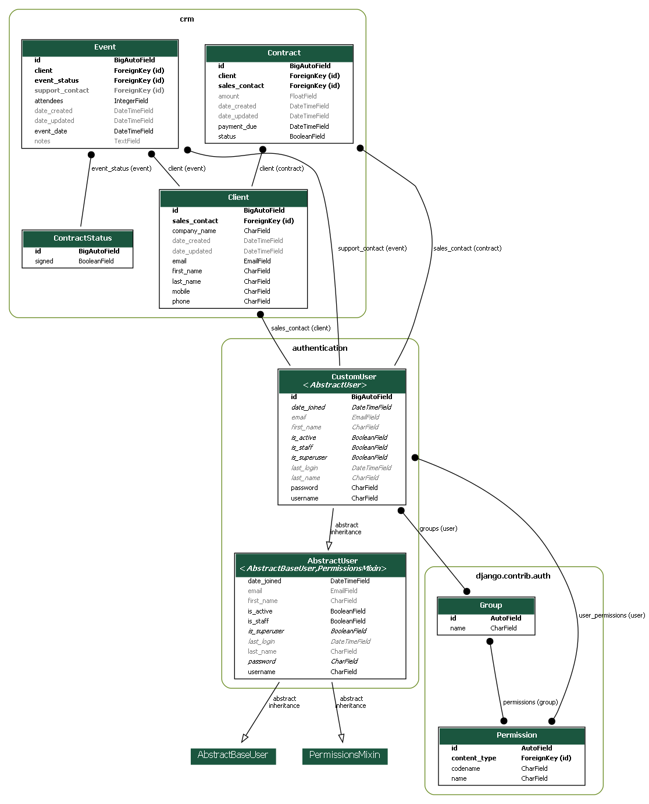

# Epic Events

An event management and consulting company that caters to the needs of start-ups wanting to throw "epic parties".


## Installation

You will need to download & install Python :

[Windows](https://www.python.org/downloads/windows/)

[Linux](https://www.python.org/downloads/source/)

[MacOS](https://www.python.org/downloads/macos/)

Once Python is installed, grab pipenv with :
```python
pip install pipenv
```


Install repository dependencies with pipenv :
```python
pipenv install -r requirements.txt
```

Go inside the newly created virtual environnement

```python
pipenv shell
```

This API uses postgre as database, you will need to modify the information in settings.py
```python
DATABASES = {
    'default': {
        'ENGINE': 'django.db.backends.postgresql',
        'NAME': 'epicevents', <- Database name
        'USER': 'admin_epicevents', <- Database user
        'PASSWORD': 'admin123', <- Database user's password
        'HOST': '127.0.0.1', <- Database host
        'PORT': '5432', <- Database port
    }
}
```

Start server with :
```python
python manage.py runserver
```

Create a superuser and access django's administrator page :
```python
python manage.py createsuperuser
```

Once you've filled the form, you may go to your website and login using the super user you've just created

## Screenshots
This is an auto generated ERD for API




## Documentation

Hosted by [Postman](https://documenter.getpostman.com/view/17664575/UVeDrmgi#91f131d1-4e4c-438a-abe9-91d77763c72d)


## Author

- [Danycm1](https://www.github.com/Danycm1)